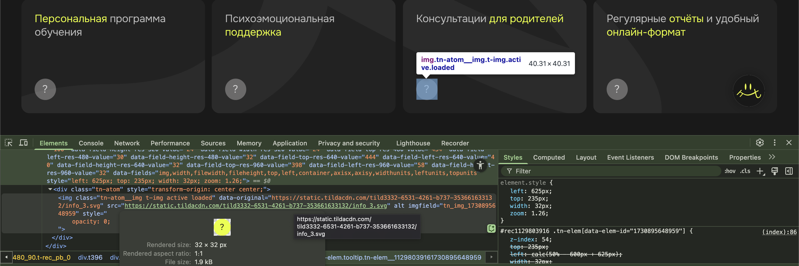
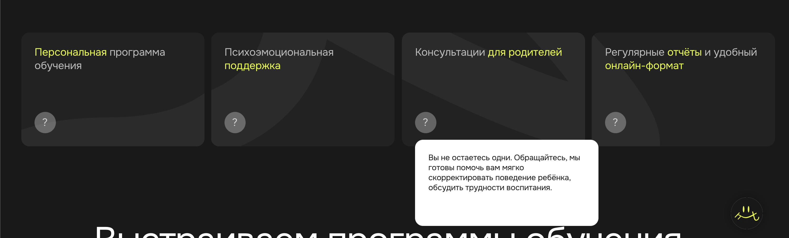

# Custom Tooltip Module for a Tilda Website

## Описание
Кастомный модуль для создания подсказок (tooltip) на сайте, собранном на платформе **Tilda**. Модуль позволяет легко добавлять стильные и функциональные всплывающие подсказки к элементам страницы, улучшая пользовательский опыт.

## Функционал
- Отображение всплывающих подсказок при наведении или клике
- Настройка позиции и стилей подсказок через CSS
- Лёгкая интеграция в Tilda через вставку кастомных скриптов и стилей
- Поддержка нескольких элементов с индивидуальными подсказками на одной странице

## Технологии
- JavaScript (ES6+)
- CSS3
- Платформа Tilda (кастомизация через код)

## Пример использования

### Настройка в редакторе Tilda

- Добавьте элементы (шейпы с загруженными фотографиями), к которым хотите привязать подсказки (нижний – стандартное состояние, верхний – активное/hover состояние).
- Для каждого элемента (активное/hover состояние) укажите класс `tooltip`.
- Добавьте подложки под текст и тексты для подсказок.
- Для каждого текстового блока укажите класс `tooltip-content-text`.
- Для каждой подложки укажите класс `tooltip-content`.

## Порядок слоёв в редакторе Tilda

В слоях редактора элементы должны располагаться следующим образом (сверху вниз):

1. **Текст 1**
2. **Подложка 1**
3. **Тултип Hover 1**
4. **Тултип Стандарт 1**

### Пример визуальной структуры

*Пример тултипов стандартного и активного/hover состояний.*

*Пример текста и подложек тултипов.*

